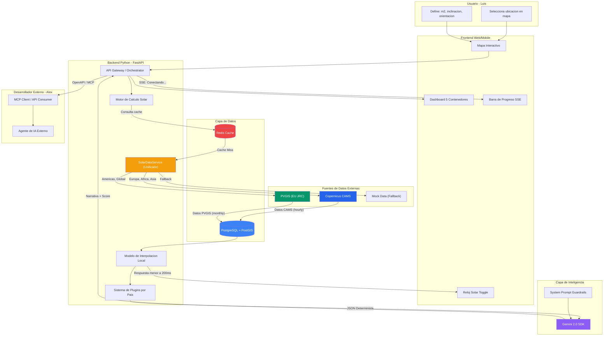
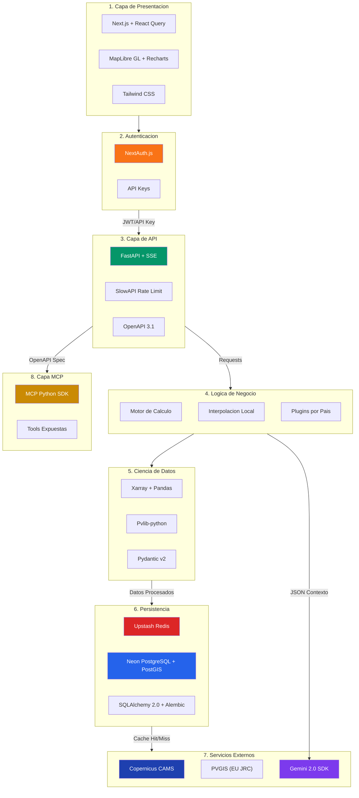
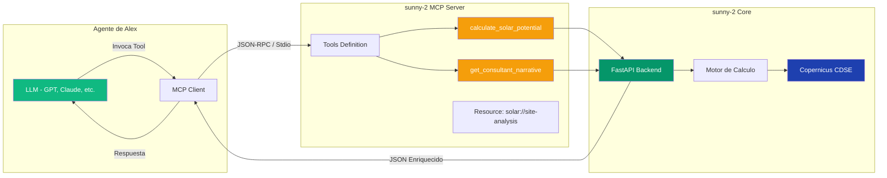

# Fundamentos del Stack Tecnológico - sunny-2

Este documento describe cada componente tecnológico que conforma la arquitectura de **sunny-2**, explicando su propósito y cómo interactúa con el resto del sistema. Está diseñado para que cualquier persona, independientemente de su experiencia técnica, pueda comprender cómo funciona la solución.

---

## 🌐 Diagrama de Flujo de Datos (Arquitectura de Flujo)

El siguiente diagrama muestra cómo viaja la información desde el momento en que un usuario selecciona una ubicación en el mapa, hasta que recibe su diagnóstico solar completo con la narrativa del Consultor de IA.



### ¿Cómo funciona este flujo?

**Idea 1: Estrategia de Cascada de Datos.** Cuando Luis marca un punto en el mapa, el sistema envía las coordenadas al **SolarDataService**, un servicio unificado que selecciona inteligentemente la mejor fuente de datos:
- **CAMS (Copernicus):** Primera opción para Europa, África, Medio Oriente y Asia. Proporciona datos horarios de alta precisión.
- **PVGIS (EU JRC):** Fallback automático para las Américas (incluyendo Chile) y cualquier ubicación global. Proporciona datos mensuales de calidad.
- **Mock Data:** Último recurso si ambas fuentes fallan, para garantizar que el usuario siempre reciba una estimación.

**Idea 2: Del Cálculo al Consejo.** Una vez que los datos llegan de cualquiera de las fuentes, el Motor de Cálculo de Python los procesa y genera un "Modelo de Interpolación Local". Este modelo permite que Luis mueva la inclinación de sus paneles virtuales y vea el resultado instantáneamente, sin esperar a que el satélite responda de nuevo. Finalmente, todos los números se envían a Gemini 2.0, que los convierte en un consejo claro y científico.

**Idea 3: Cobertura Global Real.** Gracias a la integración de PVGIS, sunny-2 ahora tiene cobertura del **100% del planeta**. Ubicaciones como Santiago de Chile, Nueva York o Sydney reciben datos reales de radiación solar, no estimaciones genéricas.

---

## 🛠️ Stack Tecnológico Detallado

El siguiente diagrama muestra las tecnologías específicas que utilizamos, cómo se comunican entre sí y qué rol cumple cada una dentro de la arquitectura de sunny-2.



**Leyenda de Capas:**
| Número | Capa | Descripción |
|--------|------|-------------|
| 1 | Presentación | Frontend: Next.js, MapLibre GL, Recharts, Tailwind CSS |
| 2 | Autenticación | NextAuth.js (usuarios) + API Keys (desarrolladores) |
| 3 | API | Orquestación: FastAPI con SSE, Rate Limiting (SlowAPI), OpenAPI 3.1 |
| 4 | Lógica | Motor de Cálculo Solar, Interpolación, Plugins por País, **SolarDataService** |
| 5 | Ciencia | Procesamiento de datos: Xarray, Pandas, Pvlib, Pydantic v2 |
| 6 | Persistencia | Cache (Upstash Redis), DB (Neon PostgreSQL + PostGIS), ORM (SQLAlchemy 2.0) |
| 7 | Externos | **CAMS (Copernicus)**, **PVGIS (EU JRC)** y Gemini 2.0 |
| 8 | MCP | Exposición para agentes externos via MCP SDK |

---

### Componentes del Stack

#### 🐍 Python 3.12+

**¿Qué es?** Python es el lenguaje de programación principal que usamos para construir el "cerebro" de sunny-2. Es conocido por su simplicidad y su potente ecosistema para ciencia de datos, lo que lo hace ideal para procesar información satelital y realizar cálculos complejos de física solar.

**¿Cómo interactúa?** Python actúa como el director de orquesta. Recibe las coordenadas del usuario, solicita datos a los satélites, ejecuta los cálculos de radiación, genera los modelos de interpolación y prepara el contexto que Gemini 2.0 necesita para generar sus consejos. Todo el backend de sunny-2 está escrito en Python.

---

#### ⚡ FastAPI

**¿Qué es?** FastAPI es un marco de trabajo (framework) moderno para construir APIs (interfaces de comunicación) en Python. Es extremadamente rápido y tiene soporte nativo para SSE (Server-Sent Events), que es la tecnología que permite mostrar mensajes de progreso en tiempo real ("Conectando satélites...").

**¿Cómo interactúa?** FastAPI es la "puerta de entrada" del sistema. Recibe todas las solicitudes del frontend (cuando Luis hace clic en el mapa) y de los agentes externos (cuando Alex conecta su bot). Gestiona la autenticación mediante API Keys y protege el sistema con límites de velocidad (Rate Limiting) para evitar abusos.

---

#### 📊 Xarray & Pandas

**¿Qué es?** Son librerías de Python diseñadas para manejar grandes volúmenes de datos. Xarray está especializado en datos científicos multidimensionales (como los que vienen de satélites, con latitud, longitud, tiempo y múltiples variables), mientras que Pandas es el estándar para análisis de datos tabulares.

**¿Cómo interactúa?** Cuando Copernicus envía 20 años de datos climáticos en formatos científicos (NetCDF o GRIB), Xarray los abre, los organiza y permite extraer exactamente la información que necesitamos para un punto geográfico específico. Pandas luego transforma esos datos en tablas limpias que el Motor de Cálculo puede usar.

---

#### ☀️ Pvlib-python

**¿Qué es?** Es una librería de código abierto desarrollada por el Laboratorio Nacional de Energías Renovables (NREL) de Estados Unidos. Contiene todas las fórmulas físicas y modelos matemáticos necesarios para simular el comportamiento de paneles solares en cualquier parte del mundo.

**¿Cómo interactúa?** Pvlib-python recibe los datos de radiación (GHI, DNI) procesados por Xarray y los transforma en estimaciones de energía generada (kWh). Considera factores como la eficiencia del panel, las pérdidas por temperatura, la inclinación y la orientación. Es el corazón científico de la precisión de sunny-2.

---

#### 🌍 PVGIS (Photovoltaic Geographical Information System)

**¿Qué es?** PVGIS es un servicio web gratuito del Centro Común de Investigación (JRC) de la Comisión Europea. Proporciona datos de radiación solar y estimaciones de producción fotovoltaica para cualquier ubicación del planeta, utilizando múltiples bases de datos satelitales.

**Bases de datos disponibles:**
| Base de Datos | Cobertura | Años |
|---------------|-----------|------|
| PVGIS-SARAH2 | Europa, África, Medio Oriente | 2005-2020 |
| PVGIS-NSRDB | Américas (incluyendo Chile) | 1998-2019 |
| PVGIS-ERA5 | Global (fallback) | 2005-2020 |

**¿Cómo interactúa?** PVGIS actúa como **fuente de datos secundaria** en sunny-2. Cuando un usuario consulta una ubicación fuera de la cobertura del satélite Meteosat (que alimenta CAMS), el sistema automáticamente consulta a PVGIS. Esto garantiza que ubicaciones como Santiago de Chile, Nueva York o São Paulo reciban datos reales de radiación solar en lugar de estimaciones genéricas.

**Ventajas clave:**
- Respuesta rápida (segundos, no minutos como CAMS)
- Cobertura global garantizada
- Incluye ángulos óptimos de inclinación pre-calculados
- Datos mensuales de alta calidad para estimaciones anuales

---

#### 🤖 Gemini 2.0 SDK (`google-generativeai`)

**¿Qué es?** Es el kit de desarrollo (SDK) oficial de Google para conectarse a su modelo de inteligencia artificial Gemini 2.0. Permite que nuestra aplicación "hable" con la IA, enviándole datos y recibiendo respuestas en lenguaje natural.

**¿Cómo interactúa?** El Motor de Cálculo empaqueta todos los resultados numéricos en un JSON estructurado y se lo envía a Gemini 2.0 junto con un "System Prompt" muy estricto. El System Prompt le dice a la IA que actúe como un "Consultor Solar" y que solo hable de los datos que recibe, sin inventar información. Gemini devuelve una narrativa científica que el usuario final puede entender fácilmente.

---

#### 🔴 Redis

**¿Qué es?** Redis es una base de datos en memoria, lo que significa que guarda información en la RAM del servidor en lugar de en el disco duro. Esto la hace extremadamente rápida, perfecta para cachear (guardar temporalmente) datos que se consultan frecuentemente.

**¿Cómo interactúa?** Cuando Luis consulta una ubicación, el sistema primero pregunta a Redis: "¿Ya tenemos datos para este punto?". Si la respuesta es sí (Cache Hit), Redis entrega los datos en milisegundos. Si la respuesta es no (Cache Miss), se consulta a Copernicus, y una vez obtenidos, se guardan en Redis para futuras consultas en la misma zona.

---

#### 🗄️ PostgreSQL + PostGIS (via Neon/Supabase)

**¿Qué es?** PostgreSQL es una de las bases de datos relacionales más robustas y confiables del mundo. PostGIS es una extensión que le agrega superpoderes geográficos: puede almacenar puntos, polígonos y hacer cálculos de distancia, lo cual es esencial para un producto basado en mapas. Para sunny-2, utilizamos **Neon** o **Supabase** como proveedores serverless que tienen soporte nativo para PostGIS.

**¿Cómo interactúa?** PostgreSQL/PostGIS guarda de forma permanente los modelos de interpolación que generamos para cada zona consultada. También registra las consultas de los usuarios para análisis y auditoría. Gracias a PostGIS, el sistema puede encontrar eficientemente si ya existe un modelo de interpolación para un punto cercano (radio de 5km), ahorrando procesamiento. La elección de Neon/Supabase garantiza compatibilidad con las extensiones geoespaciales en un entorno serverless.

---

#### 🌐 Next.js / React

**¿Qué es?** Next.js es un framework basado en React (la librería de JavaScript de Facebook/Meta) para construir aplicaciones web modernas. Permite crear páginas rápidas, optimizadas para móviles y con buen posicionamiento en buscadores (SEO).

**¿Cómo interactúa?** Next.js es lo que Luis ve y toca. Renderiza el mapa interactivo, los gráficos de generación mensual, el dashboard de 5 contenedores y el toggle del "Reloj Solar". Se comunica con el backend de FastAPI enviando las coordenadas y los parámetros del usuario, y recibe las respuestas para mostrarlas de forma visual y atractiva.

---

#### 🗺️ MapLibre GL JS

**¿Qué es?** MapLibre GL JS es una librería de JavaScript de código abierto para renderizar mapas vectoriales interactivos. A diferencia de Leaflet (que usa imágenes rasterizadas), MapLibre utiliza la GPU del dispositivo para dibujar mapas fluidos a 60 FPS, lo que es crítico para la interactividad del "Reloj Solar".

**¿Cómo interactúa?** Cuando Luis abre sunny-2, MapLibre dibuja el mapa del mundo con tiles vectoriales y le permite hacer clic para seleccionar su ubicación. La aceleración por GPU permite que el toggle de inclinación/orientación responda instantáneamente (<200ms). El sistema incluye detección de WebGL para mostrar un mensaje amigable en dispositivos que no soporten esta tecnología.

---

#### 🎨 Tailwind CSS

**¿Qué es?** Es un framework de estilos CSS que permite diseñar interfaces de usuario de forma rápida y consistente. En lugar de escribir CSS tradicional, usamos clases predefinidas directamente en el HTML, lo que acelera el desarrollo y garantiza un diseño moderno.

**¿Cómo interactúa?** Tailwind CSS da forma visual a todo lo que Luis ve: los colores del dashboard, los bordes redondeados de los contenedores, la tipografía profesional, los tooltips que explican parámetros complejos, y la responsividad que asegura que el producto funcione igual de bien en un teléfono que en una computadora de escritorio.

---

#### 📊 React Query (TanStack Query) + Zustand

**¿Qué es?** React Query es una librería para gestionar el "estado del servidor" - los datos que vienen de la API. Zustand es una librería minimalista para gestionar el "estado del cliente" - cosas como qué panel está abierto o qué filtro está seleccionado. Juntas, proporcionan una arquitectura de estado moderna y eficiente.

**¿Cómo interactúa?** Cuando Luis solicita una estimación solar, React Query se encarga de hacer la llamada a la API, cachear la respuesta, y automáticamente refrescar los datos si es necesario. Si Luis abre el toggle del "Reloj Solar", Zustand gestiona ese estado local de la interfaz. Esta separación mantiene el código limpio y predecible.

---

#### 📈 Recharts

**¿Qué es?** Recharts es una librería de gráficos construida sobre React y D3. Permite crear visualizaciones de datos atractivas y responsivas con componentes declarativos, ideal para la "curva de campana" de generación mensual.

**¿Cómo interactúa?** Recharts recibe los datos de generación mensual calculados por el backend y los transforma en gráficos interactivos. Luis puede ver la oscilación de radiación durante el año, identificar los meses de máxima y mínima generación, y entender visualmente el "Peor Escenario" para su inversión solar.

---

#### 🔐 NextAuth.js (Auth.js)

**¿Qué es?** NextAuth.js (ahora conocido como Auth.js) es una solución de autenticación completa para aplicaciones Next.js. Soporta múltiples proveedores de identidad (Google, GitHub, email) y gestiona sesiones de forma segura con JWT y cookies HTTP-only.

**¿Cómo interactúa?** Cuando Luis quiere guardar sus estimaciones o acceder a funciones avanzadas, NextAuth.js gestiona su inicio de sesión. La sesión se almacena de forma segura y se verifica en cada petición al backend. Para Alex (el desarrollador), se usa un sistema separado de API Keys que no requiere sesión de navegador.

---

#### ⚡ SlowAPI (Rate Limiting)

**¿Qué es?** SlowAPI es una librería de Python que implementa límites de velocidad (rate limiting) para APIs FastAPI. Protege el sistema de abusos y asegura que la cuota de Copernicus no se agote por un solo usuario malicioso.

**¿Cómo interactúa?** Cada petición a la API es evaluada por SlowAPI antes de ser procesada. Si un usuario o API Key excede el límite permitido (ej. 100 peticiones/minuto), recibe un error 429 (Too Many Requests) con información sobre cuándo puede reintentar. Esto protege tanto el sistema como la cuota de APIs externas.

---

#### 🗃️ SQLAlchemy 2.0 + Alembic

**¿Qué es?** SQLAlchemy 2.0 es el ORM (Object-Relational Mapper) más popular de Python, que permite interactuar con bases de datos usando objetos de Python en lugar de SQL crudo. Alembic es su compañero para gestionar migraciones de esquema de base de datos.

**¿Cómo interactúa?** Cuando el backend necesita guardar un modelo de interpolación o buscar datos cacheados, SQLAlchemy traduce las operaciones de Python a queries SQL optimizadas. Alembic gestiona los cambios en la estructura de la base de datos a lo largo del tiempo, permitiendo evolucionar el esquema sin perder datos.

---

## 🤖 MCP Server Design (Multi-Agent Communication Protocol)

El MCP Server permite que **otros agentes de inteligencia artificial** (como el de Alex) puedan consumir los servicios de sunny-2 de forma programática, como si fueran herramientas dentro de su propio flujo de trabajo.



---

### ¿Qué es MCP?

**Idea 1: Un estándar para que las IAs usen herramientas.** MCP (Model Context Protocol) es un protocolo creado por Anthropic que permite a los modelos de lenguaje (como Claude, GPT o Gemini) invocar "herramientas" externas de forma estandarizada. Piensa en MCP como un enchufe universal que permite a cualquier agente de IA conectarse a sunny-2 y usar sus capacidades de cálculo solar sin tener que entender cómo funciona internamente.

**Idea 2: sunny-2 como proveedor de inteligencia solar.** Al exponer nuestras funciones como un servidor MCP, convertimos a sunny-2 en una fuente de verdad científica que otros sistemas pueden consultar. Alex, por ejemplo, puede construir un agente de IA para análisis inmobiliario que automáticamente pregunte a sunny-2: "¿Cuánta energía solar puede generar esta propiedad?" y reciba una respuesta precisa y estructurada.

---

### Herramientas Expuestas (Tools)

#### `calculate_solar_potential`

**¿Qué hace?** Esta herramienta recibe las coordenadas geográficas, la superficie en m², la inclinación y la orientación de los paneles, y devuelve un JSON completo con la estimación de generación mensual, el `data_tier` (Engineering/Standard) y el `confidence_score`.

**Ejemplo de invocación:**
```json
{
  "tool": "calculate_solar_potential",
  "arguments": {
    "latitude": -33.4489,
    "longitude": -70.6693,
    "area_m2": 15,
    "tilt_degrees": 20,
    "orientation": "north"
  }
}
```

**Ejemplo de respuesta:**
```json
{
  "data_tier": "engineering",
  "confidence_score": 0.92,
  "annual_generation_kwh": 4250,
  "monthly_breakdown": {
    "january": 520,
    "february": 480,
    "...": "..."
  },
  "metadata": {
    "source": "Copernicus CAMS McClear",
    "data_years": "2004-2024"
  }
}
```

---

#### `get_consultant_narrative`

**¿Qué hace?** Esta herramienta toma los datos calculados y los envía a Gemini 2.0 para generar una narrativa científica en lenguaje natural. Es útil para agentes que quieren presentar la información de forma legible a usuarios finales.

**Ejemplo de respuesta:**
```json
{
  "ai_insights": {
    "summary": "Tu ubicación en Santiago recibe una radiación solar excepcional...",
    "seasonal_analysis": "Durante el verano (diciembre-febrero), la generación alcanza su pico...",
    "recommendations": "Considerando tu inclinación de 20°, podrías optimizar..."
  },
  "citations": [
    "Datos de ERA5-Land, European Centre for Medium-Range Weather Forecasts",
    "Modelo McClear, Copernicus Atmosphere Monitoring Service"
  ]
}
```

---

### Recursos Expuestos (Resources)

#### `solar://site-analysis/{lat},{lon}`

**¿Qué es?** Los "Resources" en MCP son URIs que apuntan a datos estáticos o semi-estáticos. Este recurso permite a un agente leer el análisis completo de un sitio previamente calculado, sin necesidad de invocar una herramienta.

**Uso típico:** Un agente que está procesando múltiples propiedades puede primero verificar si ya existe un análisis en cache para una coordenada antes de solicitar un cálculo nuevo.

---

### Integración con Copernicus CDSE (Atmosphere Data Store)

Para solicitar datos al servicio de Copernicus, utilizamos el siguiente formato JSON estandarizado que cumple con los requisitos de la API del Atmosphere Data Store:

```python
# Estructura de solicitud al Atmosphere Data Store de Copernicus
request_params = {
    "sky_type": "observed_cloud",
    "location": {
        "longitude": round(float(lon), 5),
        "latitude": round(float(lat), 5)
    },
    "altitude": ["-999."],
    "date": [f"{year}-01-01/{year}-12-31"],
    "time_step": "1hour",
    "time_reference": "universal_time",
    "data_format": "csv"
}
```

#### Explicación de los parámetros:

| Parámetro | Descripción |
|-----------|-------------|
| `sky_type` | Tipo de cielo. `observed_cloud` usa datos reales de nubosidad satelital. |
| `location.longitude` | Longitud del punto, redondeada a 5 decimales para precisión de ~1 metro. |
| `location.latitude` | Latitud del punto, con el mismo redondeo. |
| `altitude` | Altitud del punto. `-999.` indica que Copernicus debe inferirla del modelo de elevación. |
| `date` | Rango de fechas en formato ISO. Ejemplo: `2024-01-01/2024-12-31` para un año completo. |
| `time_step` | Resolución temporal. `1hour` proporciona datos cada hora. |
| `time_reference` | Referencia horaria. `universal_time` (UTC) asegura consistencia global. |
| `data_format` | Formato de salida. `csv` facilita el procesamiento con Pandas. |

---

### Seguridad del MCP Server

**Autenticación:** Todos los consumidores externos (como Alex) deben registrar una API Key única. Esta clave se inyecta en las cabeceras de las solicitudes HTTP o en el canal de transporte Stdio de MCP.

**Rate Limiting:** Para proteger nuestra cuota de Copernicus y evitar abusos, implementamos límites de solicitudes por minuto/hora basados en la API Key del consumidor.

---

## 🛡️ Sistema de Protección y Resiliencia

sunny-2 implementa múltiples capas de protección para garantizar disponibilidad y evitar sobredemanda de servicios externos:

```
┌─────────────────────────────────────────────────────────────────────────────┐
│                    ARQUITECTURA DE PROTECCION                               │
└─────────────────────────────────────────────────────────────────────────────┘

    Internet
        │
        ▼
┌───────────────────┐
│  Vercel Edge      │  ← Proteccion DDoS incluida
│  (CDN/WAF)        │
└───────────────────┘
        │
        ▼
┌───────────────────┐
│  Rate Limiter     │  ← SlowAPI: 100 req/min (auth)
│  (FastAPI)        │     30 req/min (anonymous)
└───────────────────┘
        │
        ▼
┌───────────────────┐
│  Cache Layer 1    │  ← Redis: TTL 1 hora
│  (Upstash Redis)  │     Evita llamadas redundantes
└───────────────────┘
        │
        ▼
┌───────────────────┐
│  Cache Layer 2    │  ← PostgreSQL: TTL 30 dias
│  (Neon + PostGIS) │     Busqueda geoespacial 5km
└───────────────────┘
        │
        ▼
┌───────────────────┐
│  Circuit Breaker  │  ← Falla rapido si API caida
│  + Semaphore      │     Max 5 concurrent Copernicus
└───────────────────┘
        │
        ▼
┌───────────────────┐
│  APIs Externas    │  ← CAMS: 10 req/min
│  (Rate Limited)   │     PVGIS: 20 req/min
└───────────────────┘
```

### Mecanismos de Protección

| Capa | Mecanismo | Límite | Propósito |
|------|-----------|--------|-----------|
| **Edge** | Vercel WAF | Automático | DDoS, bots maliciosos |
| **API Gateway** | SlowAPI | 100 req/min/IP | Prevenir abuso general |
| **Por API Key** | Rate limit tiered | Configurable | Control por cliente |
| **Redis** | Cache exacto | TTL 1h | Evitar recálculos |
| **PostgreSQL** | Cache geoespacial | 5km, TTL 30d | Reutilizar datos cercanos |
| **Copernicus** | Semáforo + Rate limit | 10 req/min, 5 concurrent | Respetar ToS |
| **PVGIS** | Circuit Breaker | 3 failures → open | Falla rápida |
| **Fallback** | Mock data | Siempre disponible | Garantizar respuesta |

### Circuit Breaker (Patrón de Resiliencia)

El patrón Circuit Breaker protege contra fallos en cascada:

- **CLOSED:** Operación normal, las solicitudes pasan
- **OPEN:** Servicio fallando, solicitudes rechazadas inmediatamente
- **HALF_OPEN:** Probando recuperación del servicio

```
Estado CLOSED ──[5 fallos]──► Estado OPEN ──[60s timeout]──► Estado HALF_OPEN
       ▲                                                            │
       │                                                            │
       └────────────────────[3 éxitos]──────────────────────────────┘
```

### Monitoreo en Tiempo Real

sunny-2 expone métricas detalladas vía endpoint `/api/metrics`:

```json
{
  "circuit_breakers": {
    "copernicus": {"state": "closed", "failure_count": 0},
    "pvgis": {"state": "closed", "failure_count": 0}
  },
  "rate_limiters": {
    "copernicus": {"remaining": 10, "max_calls": 10},
    "pvgis": {"remaining": 20, "max_calls": 20}
  },
  "semaphores": {
    "copernicus": {"available": 5, "max_concurrent": 5},
    "database": {"available": 20, "max_concurrent": 20}
  }
}
```

---

## Resumen Visual del Stack

| Capa | Tecnología | Función Principal |
|------|------------|-------------------|
| **Presentación** | Next.js, MapLibre GL, Tailwind, Recharts | Interfaz visual para Luis |
| **State Management** | React Query (server), Zustand (client) | Gestión de estado eficiente |
| **API** | FastAPI, API Keys, SlowAPI | Orquestación y seguridad |
| **Protección** | Circuit Breaker, Rate Limiter, Semaphores | Resiliencia y control |
| **Lógica** | Python, Pvlib, SQLAlchemy 2.0, **SolarDataService** | Cálculos deterministas |
| **Datos** | Xarray, Pandas, Pydantic v2 | Procesamiento científico |
| **Persistencia** | Redis (Upstash), PostgreSQL + PostGIS (Neon/Supabase) | Cache y almacenamiento |
| **Auth** | NextAuth.js (frontend), API Keys (backend) | Autenticación dual |
| **Externos** | **CAMS (Copernicus)**, **PVGIS (EU JRC)**, Gemini 2.0 | Datos satelitales e IA |
| **Agentes** | MCP SDK | Exposición para otros LLMs |

---

## 🌐 Cobertura de Fuentes de Datos

sunny-2 implementa una **estrategia de cascada** para garantizar cobertura global:

```
┌─────────────────────────────────────────────────────────────────────┐
│                    COBERTURA GLOBAL 100%                            │
├─────────────────────────────────────────────────────────────────────┤
│                                                                     │
│   ┌───────────────────┐   ┌───────────────────┐   ┌─────────────┐  │
│   │  CAMS (Copernicus)│   │  PVGIS (EU JRC)   │   │  Mock Data  │  │
│   │                   │   │                   │   │             │  │
│   │  Europa           │   │  NSRDB: Americas  │   │  Fallback   │  │
│   │  Africa           │   │  SARAH2: EU/AF    │   │  ultimo     │  │
│   │  Medio Oriente    │   │  ERA5: Global     │   │  recurso    │  │
│   │  Asia Occidental  │   │                   │   │             │  │
│   │                   │   │                   │   │             │  │
│   │  ⚡ Datos horarios │   │  📊 Datos mensual │   │  📈 Estimado│  │
│   └───────────────────┘   └───────────────────┘   └─────────────┘  │
│          │                        │                      │         │
│          └────────────┬───────────┘──────────────────────┘         │
│                       ▼                                             │
│              SolarDataService                                       │
│         (Seleccion inteligente)                                     │
│                                                                     │
└─────────────────────────────────────────────────────────────────────┘
```

| Ubicación | Fuente Primaria | Tipo de Datos | GHI Ejemplo |
|-----------|-----------------|---------------|-------------|
| Madrid 🇪🇸 | CAMS | Horario (8760 pts/año) | 1,825 kWh/m² |
| Santiago 🇨🇱 | PVGIS-ERA5 | Mensual (12 pts/año) | 2,086 kWh/m² |
| New York 🇺🇸 | PVGIS-NSRDB | Mensual (12 pts/año) | 1,460 kWh/m² |
| Sydney 🇦🇺 | PVGIS-ERA5 | Mensual (12 pts/año) | 1,708 kWh/m² |

---

---

_Documento generado como parte del flujo de Arquitectura de sunny-2._

**Historial de Cambios:**
| Fecha | Cambio |
|-------|--------|
| 2025-12-24 | Versión inicial |
| 2025-12-29 | Agregada integración PVGIS, estrategia de cascada de datos, cobertura global 100% |
| 2025-12-29 | Agregado Sistema de Protección: Circuit Breaker, Rate Limiting tiered, Semaphores, Métricas |

